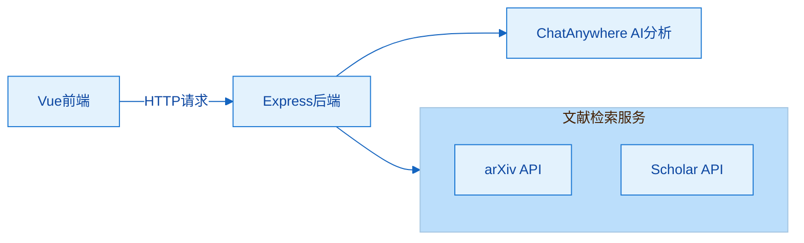

#  PaperPuppy - 自动化研究现状收集与去幻觉系统

<div align="center">
  
</div>


## 项目简介

本项目旨在构建一个自动化研究现状分析与"去幻觉"系统，能够针对任意研究主题自动检索论文（如 arXiv、Scholar），抓取标题与摘要，并利用 GPT 进行多文献交叉比对与综合总结。

系统实现了基础的幻觉控制机制，如多文献一致性评分、引用出现频次统计、关键术语匹配验证与模型自估置信度，从而输出更可信的研究综述结果。

系统支持自动生成 Markdown/PDF 报告，并可扩展为研究时间轴、主题结构图谱或自动综述草稿。

## 最近改进

### 性能与稳定性
- **热点文章推荐优化**：专注推荐高引用计算机领域，来源可靠的文章
- **修复内存泄漏**：解决了tiktoken资源未释放导致的内存泄漏问题，确保系统能够稳定处理多次连续搜索请求
- **改进错误处理**：优化了API响应格式，确保在无API密钥或异常情况下返回有效JSON响应，避免陷入持续加载
- **修复置信度评分**：解决了因年份计算错误导致的NaN值问题，确保置信度评分始终为0-100的有效数字
- **增强鲁棒性**：添加了多层防御机制，能够处理各种异常情况，如无效论文数据、API调用失败等

### 功能增强
- **支持无API密钥模式**：在没有ChatAnywhere API密钥的情况下，系统仍能提供基础的文献检索和分析功能演示
- **支持OpenAlex和Semantic Scholar的API配置优化**：用户可以在系统中配置OpenAlex和Semantic Scholar的API密钥，以获取更好的使用体验
- **改进文献分析算法**：优化了论文一致性评分计算，提供更准确的多文献交叉比对结果
- **增强关键词验证**：改进了关键术语匹配验证机制，提高结果的可信度和相关性
- **优化资源管理**：实现了更高效的内存管理策略，确保系统在处理大量文献时仍能保持良好性能


## 系统架构



## 技术栈

- 前端：Vue 3 + Vite + Electron
- 后端：Node.js/Express
- AI 模型：GPT-3.5-Turbo (ChatAnywhere API)
- 文献检索：arXiv API, Google Scholar API
- 可视化：词云、时间轴、主题图谱

## 目录结构

```
├── client/           # Vue前端应用
├── server/           # 后端服务
├── test/             # 测试脚本
└── README.md         # 项目说明
```

## 功能特性

### 1. 文献检索
- 支持通过arXiv API搜索相关论文
- 支持通过Google Scholar API搜索相关论文
- 可指定搜索关键词和最大结果数量

### 2. 智能分析
- 利用GPT-3.5-Turbo对文献进行综合分析
- 生成研究综述报告

### 3. 幻觉控制机制
- **一致性评分**：评估文献之间的逻辑一致性
- **关键词统计**：统计高频关键词出现频次
- **术语验证**：验证关键术语在文献中的匹配率
- **置信度评分**：综合多项指标生成整体置信度

### 4. 数据可视化
- 词云展示高频关键词
- 研究时间轴展示文献发表时间分布
- 主题结构图谱展示研究主题关联

### 5. 报告导出
- 支持导出Markdown格式报告
- 支持导出PDF格式报告

## 快速开始

### 环境要求
- Node.js >= 14.0.0
- npm >= 6.0.0
- [ChatAnywhere API密钥](https://github.com/chatanywhere/GPT_API_free)

### 安装步骤

1. 克隆项目仓库：
```bash
git clone <repository-url>
cd PaperPuppy
```

2. 设置环境变量：
```bash
# 新建server/.env文件并根据env.example设置ChatAnywhere API密钥
CHATANYWHERE_API_KEY=your_api_key_here
```

3. 安装后端依赖：
```bash
cd server
npm install
```

4. 安装前端依赖：
```bash
cd ../client
npm install
```

### 运行系统

1. 启动后端服务：
```bash
cd server
npm start
```

2. 启动前端应用：
```bash
cd client
npm run dev
```

3. 访问应用：
打开浏览器访问 `http://localhost:5173`

## API接口

### 搜索论文
```
GET /api/search
参数：
- query: 搜索关键词
- maxResults: 最大结果数量（可选，默认10）
```

### 分析论文
```
POST /api/analyze
参数：
- papers: 论文数组
- query: 搜索关键词（可选）
```


## 幻觉控制机制详解

### 1. 一致性评分
通过分析文献间的逻辑关系和内容重叠度，评估文献集合的一致性。

### 2. 关键词统计
统计文献中高频关键词的出现频次，帮助识别研究热点。

### 3. 术语验证
验证用户搜索关键词在文献中的匹配程度，确保相关性。

### 4. 置信度评分
综合以上三项指标，生成0-100的置信度评分，数值越高表示结果越可信。

## 开发指南

### 前端开发
```bash
cd client
npm run dev
```

### 后端开发
```bash
cd server
npm run dev
```

### 构建生产版本
```bash
cd client
npm run build
```

## 测试

运行系统测试：
```bash
node test-system.js
```

## 未来改进计划

1. 集成更多文献数据库（如PubMed、Web of Science等）
2. 实现PDF报告导出功能
3. 增强AI分析能力，支持更多分析维度
4. 优化用户界面和交互体验
5. 添加多语言支持
6. 实现更高级的主题聚类和可视化功能
7. 增强系统的可扩展性，支持更多定制化选项

## 许可证

MIT License

## 联系方式

如有任何问题或建议，请联系项目维护者。
